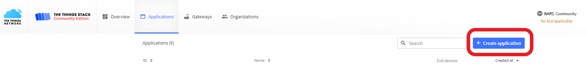

[](https://www.microchip.com)

# Agricultural IoT with the AVR64DD32 and the RN2xx3 LoRa Module
This example shows how to set up a LoRaWAN end node that monitors temperature, humidity, barometric pressure, and soil moisture and transmits that data every three minutes to an application via The Things Network (TTN).  The node will need to be placed between 10 meters to 5 kilometers meters (in urban environments) from a LoRaWAN gateway. The design demonstrates how an end node, even at long range, can be configured to consume very low power/have long battery life, while securely moving valuable data.  This design can be scaled easily to enable the capture of soil variablity data by placing additional nodes throughout an agricultural plot without the need to add additional gateways or infrastructure.

This demo uses the RN2903A Module which operates on the 915 MHz frequency band and is suitable for US and Australia based projects, but can be adapted to work in other regions by selecting an alternate click board and gateway for your region.
## Related Documentation
- [AVR64DD32 Datasheet](https://ww1.microchip.com/downloads/aemDocuments/documents/MCU08/ProductDocuments/DataSheets/AVR64DD32-28-Prelim-DataSheet-DS40002315B.pdf)
- [AVD64DD32 Curiosity Nano Hardware User Guide](https://ww1.microchip.com/downloads/aemDocuments/documents/MCU08/ProductDocuments/UserGuides/AVR64DD32CNANO-Prel-HW-UserGuide-DS50003323.pdf)
- [Curiosity Nano Base Board Hardware User Guide](https://ww1.microchip.com/downloads/en/DeviceDoc/Curiosity-Nano-Base-for-Click-boards-User-Guide-50002839B.pdf)
- [RN2903 LoRa Technology Transceiver Module Data Sheet](https://ww1.microchip.com/downloads/en/DeviceDoc/50002390E.pdf)
- [RN2903 LoRa Technology Module Command Reference User's Guide](http://ww1.microchip.com/downloads/en/DeviceDoc/40001811A.pdf)
  
## Software Used
- MPLAB® X IDE 6.0.0 or newer [(MPLAB X IDE 6.0)]()
- MPLAB XC8 2.40.0 or newer compiler [(MPLAB XC8 2.40)]()
- MPLAB Code Configurator (MCC) 5.1.9 or newer [(
https://www.microchip.com/en-us/tools-resources/configure/mplab-code-configurator?utm_source=Hackster&utm_medium=TextLink&utm_campaign=MCU8_MMTCha_avrdd&utm_content=agri-iot-dd-hackster)]()
- MPLAB® Data Visualizer [(MPLAB Data Visualizer)](https://www.microchip.com/en-us/tools-resources/debug/mplab-data-visualizer)

## Hardware Used
- AVR64DD32 CNano
- Curiosity Nano Adapter
- MikroE LR2
- MikroE WeatherClick
- Capacitive Soil Moisture Sensor v2.0
- (Optional) RAKwireless RAK Discover Kit

## Setup - End Node Hardware
Add the components to the Nano Adapter Board, placing the LR2 click on MikroE Bus 2 and the Weather click on MikroE bus 1.  Connect the moisture sensor leads as shown in Figure 1, with the black ground wire connected to the CNano ground pin, the red power wire to VCC, and the yellow analog out wire to PD2 of the CNano.


*Figure 1: Hardware Setup*

Lastly, add a jumper wire between (PA1) and PD1 to allow the resetting of the LR2 click.  (PA1) is not connected by default (since it is already connected to an external clock), as a result this project enables the PD1 pin to drive the reset signal.

## Setup - Software
### End Node Environment Setup
- Download, install and open MPLABX IDE version 6.00 ( or newer)
- Download and install the XC8 C-Compiler version 2.40 (or newer)
- Open the 'avr64dd32-agri-iot-mplab-mcc.X' project as shown in Figure 2.

#### Calibrate the Sensors
To calibrate the moisture sensor, open the application.c file, and change the initial state to TEST_MOISTURE. 


*Figure 2: Setting the initial state to TEST_MOISTURE*

Later these settings can be made specific to your soil and plant needs, but for brevity, begin with the upper and lower bounds for measurements, i.e. test in dry air and in a cup of water.

Place the sensor so it is suspended in dry air.


*Figure 3: Sensor Positioned in Dry Air*

Start the Data Visulaizer and select the following settings:
- Baud Rate 9600
- Char length 8 bits
- Parity None
- Stop Bits 1
  
Click on Send to terminal, then make and program the device.  Once the program starts, you will be prompted to press the button to generate an ADC read.  Press the button a few times, then place the sensor a cup of water and press the button a few more times.

In Figure 4, the dry air samples were close to 3000, while the "in water" samples were around 1400.


*Figure 4: ADC Values in Dry Air and in a Cup of Water*

Note your values and open the application.h file then edit the following defintions for IN_MAX and IN_MIN, then use those values to calculate the CONVERSION_PERCENT using the formula shown.


*Figure 5: Soil Moisture Definitions*

Only one small change is needed to calibrate the Weather click, the rest is taken care of in software.  To have an accurate pressure reading, the device needs to use your current elevation above sea level.  Enter this value on line 24 of the bme.h file.


*Figure 6: Elevation for Weather click*

### The Things Network Application Setup
If you haven't already done so, you need to set up an a free account on TTN. The community edition is free for fair use. Sign up here. TODO: add link

After setting up your account, navigate to your console and click on Applications.


Click the Create application button and follow the instructions to create an application.



### Setup Application Uplink Payload Formatter
Click on Payload formatters then on Uplink.


Under Setup Formatter type*, select Custom Javascript formatter.

Replace the default decodeUplink function with the following:
```js
function decodeUplink(input) {
    var data = {};
    data.temp = input.bytes[0];
    data.humidity = input.bytes[1];
    data.moisture = input.bytes[2];
    data.pressure = (input.bytes[3] * 10);
    
    return {
      data: data
    };
}
```
## Set up an End Device for Over the Air Activation (OTAA)
From the application overview page, click on the register end device button.


To register the device, we'll need a few details from the module.  Open the application.c file again and change the state to REGISTER.


Start the Data Visualizer and build and program the device again.  When the program runs note the HWEUI and LoRaWAN spec.  


Return to the register end device window on TTN, and select enter end device specifics manually.  Choose your frequency plan based on your location and enter the LoRaWAN specification.  In the provisioning information, enter all zeros for the JoinEUI field, then hit confirm.


Paste the HWEUI you copied earlier into the DEVEUI field then click on Generate to generate a new AppKey.


## Operation


## Summary